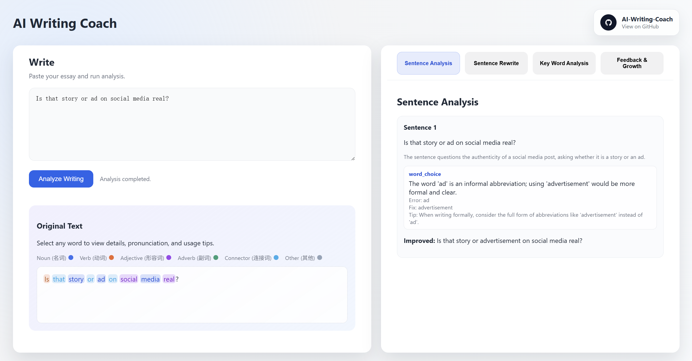
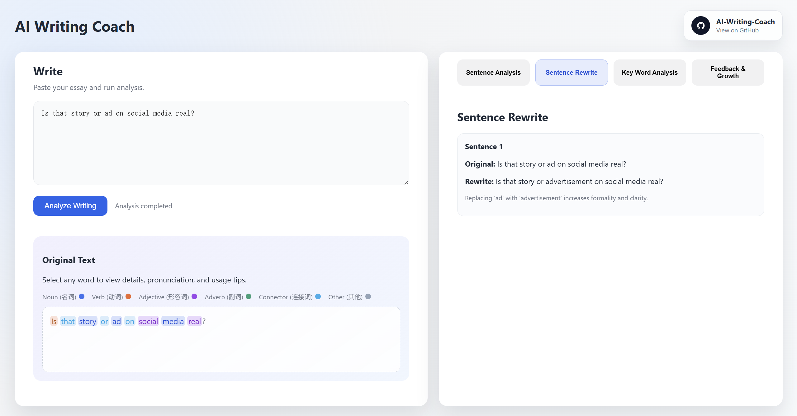
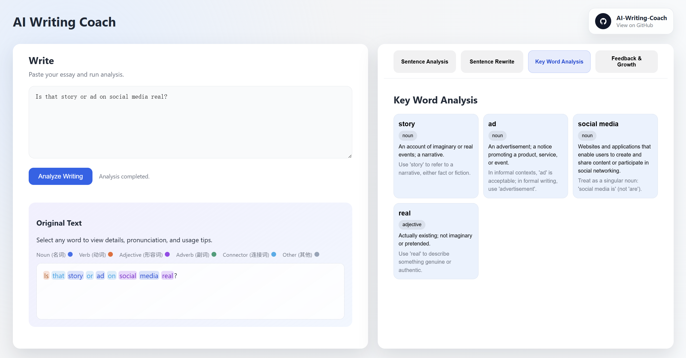

# AI Writing Coach

AI Writing Coach is an open-source English writing analysis tool. It provides sentence-level analysis, rewrite suggestions, key word explanations, and overall feedback through a configured AI model.

This open-source edition is simplified for direct classroom or personal use. It does not include an admin backend, user accounts, history storage, Word upload, targeted micro practice, or AI mentor chat.

## Demo

### Sentence Analysis



### Sentence Rewrite



### Key Word Analysis



## Features

- Sentence-by-sentence writing analysis
- Rewrite suggestions with explanations
- Key word definitions and usage tips
- Part-of-speech highlighting in the original text
- Overall feedback for strengths, weaknesses, and next steps
- File-based access password
- AI model settings configured in `config/app.php`

## Requirements

- PHP 8.1+
- PHP `curl` extension
- An OpenAI-compatible API endpoint and API key

## Quick Start

1. Configure AI settings in `config/app.php`.

2. Start the local PHP server:

   ```bash
   php -S localhost:8080 -t public
   ```

3. Visit:

   ```text
   http://localhost:8080
   ```

## Configuration

Edit `config/app.php`:

```php
'open_source' => [
    // Set empty string '' to disable password gate.
    'access_password' => 'change-this-password',

    'ai_settings' => [
        'base_url' => 'https://api.openai.com/v1',
        'api_key' => 'your-api-key',
        'model' => 'gpt-4.1-mini',
    ],
],
```

## Access Password

- Set `access_password` to a real password to enable the password gate.
- Set `access_password` to an empty string `''` to disable the password gate.

## AI Provider

The app uses the OpenAI-compatible chat completions API format. You can point `base_url`, `api_key`, and `model` to your own compatible provider.

If `api_key` is empty, analysis requests will fail.

## Advanced Version

For more advanced writing analysis features, use the hosted version:

https://write.longxialabs.com/

## Repository

https://github.com/LobsterEnigma/AI-Writing-Coach
